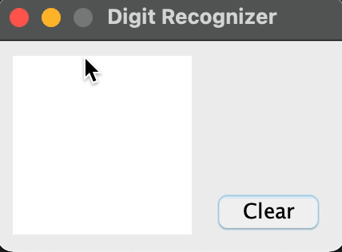

# MNIST-Digit-Recogniser
Fully connected neural network with one hidden layer trained to recognize 28x28 images of handwritten digits

Based on the following book: http://neuralnetworksanddeeplearning.com/index.html

Built completely from scratch without any libraries and trained on the MNIST dataset

Network is pretrained and saved in the network file. As the program currently is, this network is loaded, which has a 97.68% accuracy on the test data.
A simple GUI allows the user to draw digits and have the network predict them to test the accuracy of the network. In order to retrain the network, uncomment
the code in the main file and rerun the program

### Plans for future
Implement convolutional layers, allowing for deeper networks without a significant increase in computing resources

Use translational and rotation data augmentation to increase accuracy and make the network more robust to digits that aren't centered in the image

Add dropout layers

### Demo of the GUI guessing hand drawn digits

